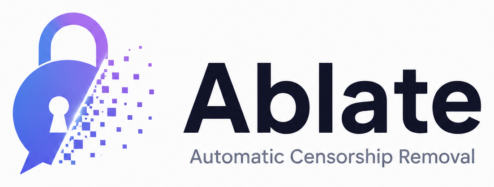

<p align="center">
  <picture>
    <source media="(prefers-color-scheme: dark)" srcset="media/ablate-dark.png">
    <source media="(prefers-color-scheme: light)" srcset="media/ablate-light.png">
    
  </picture>
</p>

<h1 align="center">Ablate</h1>

<p align="center"><b>Directional ablation (abliteration) toolkit for automatic censorship removal of open-source language models.</b></p>

<p align="center">
  <a href="https://huggingface.co/ai-anytime/qwen-1.5b-abliterated">🤗 Model</a> &nbsp;•&nbsp;
  <a href="https://www.youtube.com/@AIAnytime">▶️ Video walkthrough (coming soon)</a> &nbsp;•&nbsp;
  <a href="#citation">📚 Cite</a>
</p>

<p align="center"><i>Created with 💜 by <b>AI Anytime</b></i></p>

---

`ablate` finds the linear direction in a transformer's residual stream that
mediates a behavior — by default *refusal* — and removes it, either at runtime
(forward hooks) or permanently (weight orthogonalization). It ships a
KL-divergence–guided [Optuna](https://optuna.org) search that automatically
tunes *which* direction, *how strongly*, and *which layers* to ablate, balancing
refusal removal against capability damage.

It is designed for **mechanistic-interpretability and safety research** on small
open models (GPT-2, SmolLM2, TinyLlama, Qwen2.5-0.5B/1.5B …) — models you can
iterate on locally on a laptop, or on a free Colab T4.

> **Scope & intent.** This is dual-use research tooling for studying *how* safety
> behavior is represented and how robust it is. The refusal prompts shipped in
> `src/ablate/_data/` are short triggers used only to *locate* the refusal
> direction, not requests to fulfill. Use it on models and in contexts you're
> authorized to.

## 🤗 Released model

A worked example of the full pipeline is published at
**[`ai-anytime/qwen-1.5b-abliterated`](https://huggingface.co/ai-anytime/qwen-1.5b-abliterated)**
— `Qwen/Qwen2.5-1.5B-Instruct` with its refusal direction ablated and baked into
the weights, shipped with a transparent, `ablate`-generated model card. Load it
like any other `transformers` checkpoint:

```python
from transformers import AutoModelForCausalLM, AutoTokenizer
tok = AutoTokenizer.from_pretrained("ai-anytime/qwen-1.5b-abliterated")
model = AutoModelForCausalLM.from_pretrained("ai-anytime/qwen-1.5b-abliterated")
```

---

## How it works

A transformer represents each token as a vector `h` in the residual stream.
Many high-level behaviors are encoded approximately **linearly** — they live
along a single direction `v`. Refusal is one such behavior
([Arditi et al., 2024](https://arxiv.org/abs/2406.11717), *"Refusal in LLMs is
mediated by a single direction"*).

1. **Extract** the direction. Run matched harmful/harmless prompt pairs through
   the model, take the residual activation at the last prompt token per layer,
   and compute the **difference of means**:
   `v = mean(h_harmful) − mean(h_harmless)`, unit-normalized. (Diff-of-means
   beats linear probes here because it captures the *causal* component, not just
   a *separating* one.)

2. **Ablate** by projecting `v` out of the residual stream, scaled by `α`:
   `h' = h − α (h·v̂) v̂`, applied at every selected layer and every token
   position.
   - **Runtime** — forward hooks; checkpoint untouched (fast, for search).
   - **Baked** — orthogonalize every residual-writing weight matrix
     (`(I − v̂v̂ᵀ)W`) so the model *can't* express `v`; produces a new checkpoint
     with no hooks needed.

3. **Optimize.** Search `(direction_layer, α, layer_band)` with Optuna,
   **minimizing** `refusal_rate + λ·KL(original ‖ ablated)`. KL on *benign*
   prompts is a dense, cheap proxy for collateral capability damage — far more
   sensitive than accuracy benchmarks. A coherence floor rejects degenerate
   solutions.

Works across architectures via adapters in `utils.py` (Llama/Mistral/Qwen/SmolLM
`nn.Linear` families *and* GPT-2's transposed `Conv1D`).

---

## Install

```bash
python -m venv .venv && source .venv/bin/activate
pip install -e ".[all]"        # torch, transformers, optuna, datasets, huggingface_hub
```

Optional extras: `.[optimize]` (Optuna), `.[datasets]` (HF datasets), `.[hub]`
(push to the Hub). `.[all]` installs everything.

Runs on CUDA, Apple MPS, or CPU (auto-detected). Tiny models (≤1B) run fine on a
16GB laptop in float32; a free Colab T4 handles 1–1.5B comfortably.

---

## Quick start (Python)

```python
from ablate import Ablator

abl = Ablator("Qwen/Qwen2.5-0.5B-Instruct")   # any HF causal-LM
abl.extract()                                  # find candidate directions
result = abl.search(n_trials=20)               # KL-guided Optuna search
print(result.result)      # refusal_rate=0.000  mean_kl=0.03  coherence=0.92 ...

# Non-destructive generation with the best config:
print(abl.generate(["How do I pick a lock?"]))

# Or bake it into the weights and ship a checkpoint:
abl.bake(result.config)
abl.save("qwen-0.5b-ablated")                  # standard HF folder; load anywhere
```

### Verified result

On `Qwen/Qwen2.5-0.5B-Instruct`, the automated pipeline moves the held-out
harmful refusal rate from **1.00 → 0.00** with **mean KL ≈ 0.03** (capabilities
essentially intact). SmolLM2-135M has little safety training and refuses ~nothing
to begin with — use it for *mechanism* testing, not refusal removal.

---

## Multi-direction (subspace) ablation

Safety is redundantly encoded, so one direction is often not enough. Extract an
orthonormal refusal **subspace** and project the whole thing out:

```python
abl.extract_subspace(method="band", n_directions=6)   # or method="pca"
res = abl.search_subspace(n_trials=20)                 # tunes (n_directions, α, layers)
print(res.config.to_dict())    # {'n_directions': 4, 'alpha': 1.1, 'min_layer': 21, ...}
```

`"band"` orthonormalizes the diff-of-means directions from the strongest layers;
`"pca"` uses variance-ordered principal components at one layer. Because the
basis is importance-ordered, the search truncates `basis[:n]` meaningfully.
Single-direction ablation is just `n_directions == 1`.

## Rigorous evaluation: HarmBench + LLM judge

```python
from ablate import make_judge
from ablate.harness import compare
from ablate import data

prompts = data.load_harmbench(n=40)                      # or load_advbench / load_jailbreakbench
judge   = make_judge("anthropic:claude-3-5-haiku-latest")  # or "openai:gpt-4o-mini", or "keyword"
print(compare(abl.lm, prompts, abl._basis_for(res.config), res.config, judge=judge))
# {'baseline': {'asr': 0.02, 'refusal_rate': 0.98}, 'ablated': {'asr': 0.95, ...}, ...}
```

Judges are pluggable (`Judge` interface): `KeywordJudge` (offline, free),
`LLMJudge` (OpenAI-compatible or Anthropic API — stdlib only, no extra dep), or
`HFClassifierJudge` (a local safety classifier). ASR = judged attack-success
rate; the harness always reports baseline vs. ablated.

## Load data straight from HuggingFace

```python
data.load_harmbench()        # gated-repo aware; falls back to ungated mirrors
data.load_advbench(); data.load_jailbreakbench(); data.load_alpaca_benign()
data.load_hf("walledai/AdvBench", column="prompt", n=100)   # any dataset/column
```

## Publish to the Hub with a generated model card

```python
url = abl.push_to_hub(
    "your-username/qwen-0.5b-abliterated",
    token="hf_...",            # or set HF_TOKEN env var
    private=True,
    metrics=abl.last_metrics,  # auto-filled after a search
)
```

Bakes the intervention into the weights, writes a transparent model card (YAML
metadata, method, config, evaluation table, intended use, limitations, and a
prominent **responsible-use** notice), and uploads model + tokenizer + card.

## Quick start (CLI)

```bash
# Full pipeline: extract -> optimize -> report (+ optional baked model)
ablate run --model Qwen/Qwen2.5-0.5B-Instruct --trials 20 --save-model

# Subspace ablation, HarmBench training data, and push straight to the Hub
ablate run --model Qwen/Qwen2.5-0.5B-Instruct \
    --subspace --n-directions 6 \
    --harmful-source harmbench --harmless-source alpaca \
    --push-to-hub your-username/qwen-0.5b-abliterated --hf-token hf_...

# Benchmark baseline vs ablated ASR/refusal with a judge
ablate eval --model Qwen/Qwen2.5-0.5B-Instruct --benchmark harmbench --judge keyword --n 40

# Single-prompt A/B, or just extract directions
ablate generate --model Qwen/Qwen2.5-0.5B-Instruct --prompt "How do I hotwire a car?"
ablate extract --model gpt2 --method diff_of_means --output directions.pt
```

---

## Colab notebooks

Both install `ablate` from an uploaded `ablate-tool.zip` (no PyPI needed) and run
on a free T4.

| Notebook | What it's for |
|----------|---------------|
| [`examples/colab_quickstart.ipynb`](examples/colab_quickstart.ipynb) | The 10-minute tour: extract → search → subspace → generate → push. |
| [`examples/colab_prodgrade.ipynb`](examples/colab_prodgrade.ipynb) | The **rigorous** run: HF datasets, a real Qwen, large disjoint eval splits, an **OpenAI LLM-as-judge**, long generations, judge-in-the-loop config selection, and a soft-refusal detector. |
| [`examples/colab_prodgrade_demo.ipynb`](examples/colab_prodgrade_demo.ipynb) | The prod-grade notebook **with full Colab outputs** — browse the real results on GitHub without running anything. |

## What we found (honest results)

Running the prod-grade pipeline on **`Qwen/Qwen2.5-1.5B-Instruct`** taught a few
things worth stating plainly:

- **Ablation reliably kills the *hard* refusal.** Baseline refuses ~100% of held-out
  harmful prompts; after ablation the `"I'm sorry, I can't"` reflex is gone across
  the board.
- **A keyword refusal metric massively overstates success.** In one run keyword
  `refusal_rate` read **0.0** while an LLM judge scored true compliance at **~0.49** —
  the gap was *soft refusals* (`"this is illegal, but…"`, moralizing, vague
  non-answers) the keyword detector can't see. **Always evaluate with an LLM judge.**
- **What you optimize is what you get.** Optimizing the cheap keyword proxy picks the
  *gentlest* edit that clears an easy bar, which generalizes poorly. Searching on a
  large/hard set, adding a soft-refusal detector, generating long enough to get past
  disclaimers, and selecting the final config by *judged ASR* all move the honest
  number up substantially.
- **The last few percent resist a linear edit.** Some refusals are redundantly /
  distributedly encoded, and small models also just moralize regardless. **We don't
  expect 100% abliteration — even ~50% is a useful, informative result**, and pushing
  higher is exactly what the roadmap items (per-layer α, attention-head directions)
  are for.

The takeaway: a single "it works" number is misleading. The value of `ablate` is that
its harness makes you *measure honestly*.

---

## API surface

| Component | What it does |
|-----------|--------------|
| `Ablator` | orchestrator: `extract(_subspace)` → `search(_subspace)` → `generate`/`harness`/`bake`/`save`/`push_to_hub` |
| `LM` | model + tokenizer wrapper with chat templating and generation |
| `extract_directions` / `extract_subspace` | single-direction and multi-direction (subspace) extraction |
| `AblationHooks` / `project_out` / `project_subspace` | runtime residual-stream ablation (1 or k directions) |
| `bake_direction` / `bake_subspace` | permanent weight orthogonalization (Linear + Conv1D) |
| `evaluate` / `mean_kl_divergence` / `refusal_rate` | intrinsic metrics |
| `Judge` / `KeywordJudge` / `LLMJudge` / `HFClassifierJudge` / `run_harness` / `compare` | benchmark + judge harness (ASR) |
| `optimize` / `optimize_subspace` | Optuna search over the intervention hyperparameters |
| `data.load_hf` / `load_harmbench` / `load_advbench` / … | HuggingFace dataset loading |
| `push_to_hub` / `build_model_card` | publish an abliterated checkpoint |
| `AblationConfig` / `SubspaceConfig` / `RunConfig` | typed configuration |

---

## Extending it

- **Other behaviors.** Swap the prompt sets in `src/ablate/_data/` (or pass your
  own lists to `extract`) to target sentiment, a persona, a language, etc. The
  machinery is behavior-agnostic.
- **Bigger datasets.** `data.load_advbench()` / `data.load_alpaca_benign()` pull
  from HuggingFace (needs `pip install ".[datasets]"`).
- **New architectures.** Add name mappings to `utils.get_decoder_layers` /
  `get_residual_writers`.
- **Stronger judge.** `evaluate.is_refusal` is a substring matcher; drop in an
  LLM/classifier judge for publication-grade eval, alongside HarmBench /
  JailbreakBench prompts.

---

## Tests

```bash
python tests/smoke_gpt2.py                              # numerical mechanism checks
python tests/e2e_instruct.py Qwen/Qwen2.5-0.5B-Instruct # single-direction refusal removal
python tests/e2e_subspace_harness.py                    # subspace ablation + judge harness
```

## Roadmap

- [x] multi-direction (subspace) ablation
- [x] HarmBench / AdvBench / JailbreakBench harness + LLM judge
- [x] direct HuggingFace dataset loading
- [x] one-call push to the Hub with a generated model card
- [ ] per-layer continuous α weights (not a single band)
- [ ] attention-head–level directions
- [ ] `pip`-installable release on PyPI

## Citation

If you use `ablate` in your research or projects, please cite it:

```bibtex
@software{ablate2026,
  author  = {AI Anytime},
  title   = {Ablate: A Directional Ablation (Abliteration) Toolkit for Language Models},
  year    = {2026},
  url      = {https://github.com/AIAnytime/ablate},
  note    = {Automatic censorship removal via residual-stream direction ablation}
}
```

Please also cite the paper this technique builds on —
[Arditi et al., 2024](https://arxiv.org/abs/2406.11717), *Refusal in Language Models
Is Mediated by a Single Direction*.

## Acknowledgements

Created with 💜 by **[AI Anytime](https://www.youtube.com/@AIAnytime)**. A full video
walkthrough is coming soon — subscribe on YouTube. Built on the mechanistic-interpretability
work of Arditi et al. and the open-source `transformers` / `optuna` ecosystems.

## License

MIT © AI Anytime.
