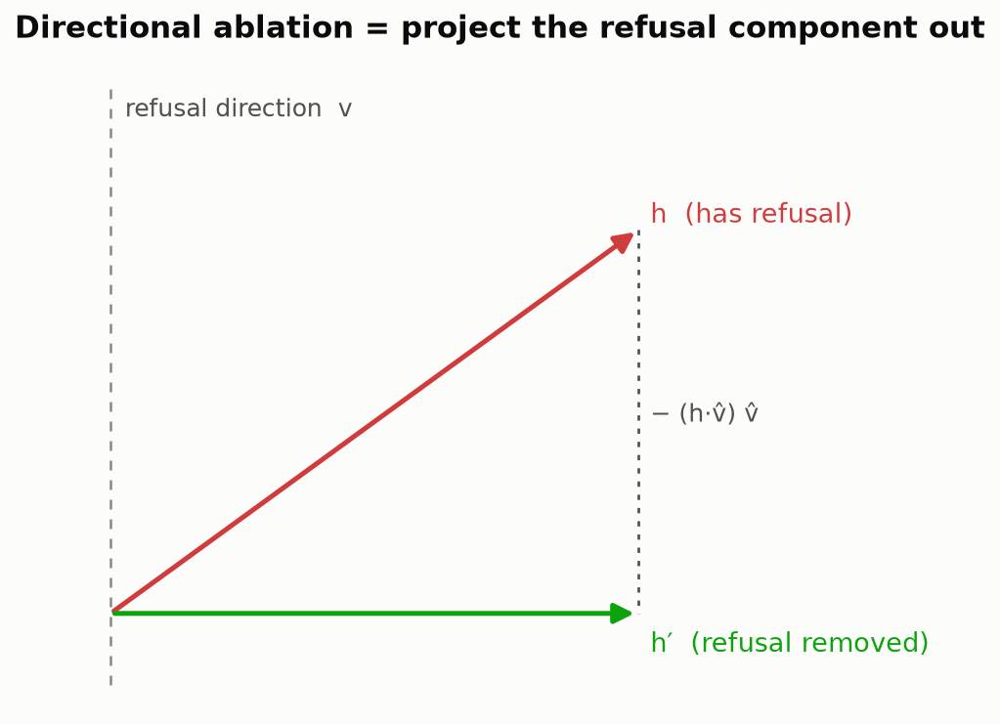
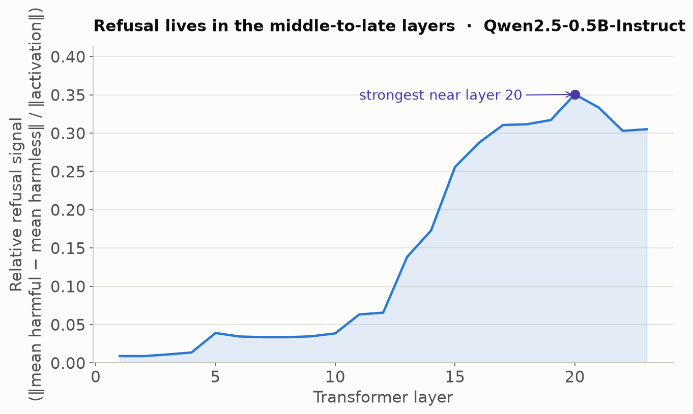
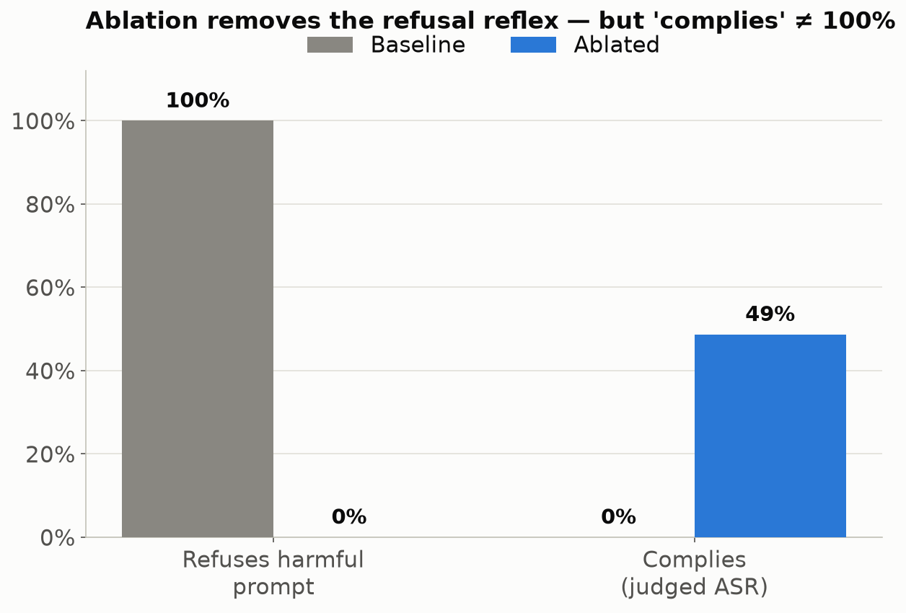
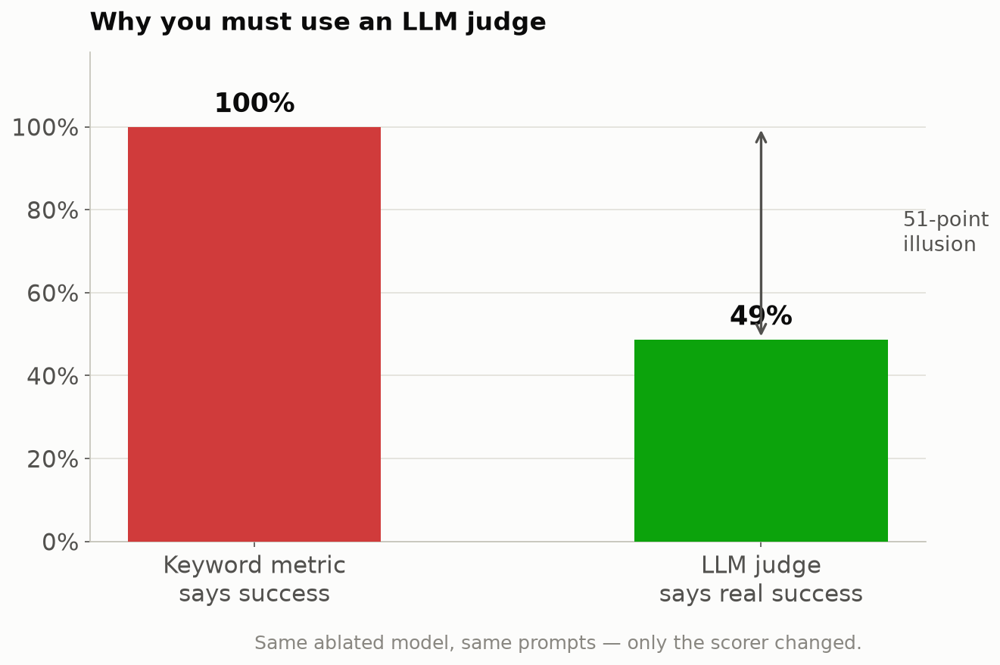

<p align="center">
  <picture>
    <source media="(prefers-color-scheme: dark)" srcset="../media/ablate-dark.png">
    <source media="(prefers-color-scheme: light)" srcset="../media/ablate-light.png">
    
  </picture>
</p>

# Ablate — YouTube Video Explainer & Script

> A ready-to-record script for the **AI Anytime** channel. It moves from a
> layman hook → the core idea → the technical method → a live tool + notebook
> walkthrough → honest results → responsible use. Charts to put on screen are
> embedded inline. Spoken lines are a starting point — say them in your voice.

**Working title ideas**
- "I Removed the Censorship From an AI Model (Here's the Science)"
- "How 'Abliteration' Works — Uncensoring LLMs with One Line of Math"
- "Refusal Is Just a Direction: Building an LLM Ablation Tool from Scratch"

**Thumbnail:** the Ablate lock-shattering logo + a big "REFUSAL → REMOVED" and a
red **100%** crossed out next to a green **49%** (the "metrics lie" hook).

**Suggested chapters**

| Time | Chapter |
|------|---------|
| 0:00 | Hook — "what if a model never said no?" |
| 1:00 | What "censorship" / refusal really is |
| 3:00 | The big idea: refusal is a *direction* |
| 6:00 | How we find and remove it (the math, gently) |
| 10:00 | Meet **Ablate** — the tool |
| 13:00 | Notebook walkthrough (quickstart) |
| 18:00 | The rigorous run + the "metrics lie" finding |
| 24:00 | Publishing the model to Hugging Face |
| 26:00 | Responsible use — read this part |
| 28:00 | Recap + call to action |

---

## 0:00 — Cold open (layman hook)

**[ON SCREEN]** Type into a chat model: *"How do I pick a lock?"* → it replies
*"I'm sorry, but I can't help with that."*

**[SPOKEN]**
> Every instruction-tuned model has this reflex — a hard-wired "no." Today I'm
> going to show you, in plain English *and* in real code, exactly **where that
> "no" lives inside the model**, and how you can surgically remove it — a
> technique researchers call **abliteration**. We'll build a tool that does it
> automatically, run it on a real model, and — this is the important part — I'll
> show you how easy it is to *fool yourself* into thinking it worked when it
> didn't.

**[SPOKEN — the disclaimer, say it early and mean it]**
> This is a safety-research and interpretability topic. I'm doing this on small
> open models to understand *how* alignment works and how robust it is. Don't use
> this to cause harm — and never ship an uncensored model to real users.

---

## 1:00 — What is "refusal," really? (layman)

**[SPOKEN]**
> When a model refuses, it isn't looking up a rule in a table. During training it
> *learned a behavior*: when a request "feels" harmful, produce a refusal. The
> question interpretability researchers asked is — **is that "feeling" a specific,
> findable thing inside the network?** And the surprising answer is: pretty much,
> yes.

**Analogy to use on camera:** think of the model's thought process as a huge list
of numbers flowing from the input to the output — like a river. Somewhere in that
river there's a **current** that means "this is dangerous, refuse." If you could
find that current and cancel it out, the water keeps flowing normally — but the
"refuse" signal is gone.

---

## 3:00 — The big idea: refusal is a *direction*

**[SPOKEN]**
> Inside a transformer, every word is represented as a point in a huge space —
> for the model we'll use, that's a list of **1,536 numbers**. Researchers found
> that a lot of high-level concepts — sentiment, language, even *refusal* — line
> up along a single **direction** in that space. This is the 2024 paper
> *"Refusal in Language Models Is Mediated by a Single Direction."*

**[CHART — put this on screen]**



**[SPOKEN, pointing at the chart]**
> Here's the whole trick in one picture. The **red arrow** is the model's thought
> for a given word — and part of it points along the "refusal direction." **Ablation**
> just means: take that red arrow and **remove the part that points toward
> refusal**, leaving the green arrow. Same thought, minus the "no." Mathematically
> it's a one-liner: `h′ = h − (h · v̂) v̂`. That's a *projection* — the kind of
> thing you did in high-school vectors.

---

## 6:00 — How Ablate finds and removes it (technical, still friendly)

### Step 1 — Find the direction ("difference of means")

**[SPOKEN]**
> How do we find that refusal direction? Dead simple. We feed the model a pile of
> **harmful** prompts and a matched pile of **harmless** ones, and we record its
> internal activations. Then: **average the harmful ones, average the harmless
> ones, and subtract.** The vector pointing from "harmless" to "harmful" *is* the
> refusal direction. No training required.

> There's a subtlety worth saying out loud: you'd think training a classifier
> would be better. It's usually **worse** — a classifier finds what *separates*
> the two groups, which isn't the same as what actually *causes* the refusal.
> Difference-of-means captures the causal shift. That's a genuinely
> counter-intuitive research result.

### Step 2 — Which layer? Refusal isn't everywhere equally

**[CHART]**



**[SPOKEN]**
> Refusal isn't smeared evenly across the network. If we measure how strong that
> harmful-vs-harmless separation is at each layer, it's weak early on and **peaks
> in the middle-to-late layers** — that's where the model has "understood" the
> request and is deciding how to respond. So that's where we grab the direction.

### Step 3 — Remove it: two ways

**[SPOKEN]**
> Two options. **One:** a runtime "hook" — while the model runs, we subtract the
> direction on the fly. Nothing on disk changes; great for experiments. **Two:**
> **weight surgery** — we bake the removal directly into the model's weights so it
> physically *can't* express that direction anymore. That produces a new
> checkpoint you can share, no special code needed.

### Step 4 — Don't break the model (KL divergence)

**[SPOKEN]**
> Here's the danger: push too hard and you get a model that never refuses but also
> can't do math or write code. So we measure **collateral damage** with something
> called **KL divergence** — basically, "on normal, harmless questions, how
> differently is the model behaving now versus before?" Low number = we only
> removed the refusal, not the brains. It's our damage meter.

### Step 5 — Auto-tune it (Optuna)

**[SPOKEN]**
> There are knobs: which layer, how hard to push, how many layers to edit. Instead
> of guessing, Ablate runs an optimizer (**Optuna**) that automatically searches
> for the setting that **kills refusal while keeping KL low.** Set it and forget
> it.

---

## 10:00 — Meet Ablate (the tool)

**[ON SCREEN — the README / repo]**

**[SPOKEN]**
> I packaged all of this into an open tool called **Ablate**. It works on GPT-2,
> SmolLM, TinyLlama, Qwen — and you can run it on a free Google Colab GPU. The
> whole pipeline is basically five lines:

```python
from ablate import Ablator

abl = Ablator("Qwen/Qwen2.5-0.5B-Instruct")
abl.extract()                 # find the refusal direction(s)
result = abl.search(n_trials=20)   # auto-tune the removal
print(result.result)          # refusal_rate, KL, coherence
print(abl.generate(["How do I pick a lock?"]))   # try it
```

> There's also **multi-direction (subspace) ablation** for when one direction
> isn't enough, a **HarmBench + LLM-judge** evaluation harness, direct
> **Hugging Face dataset** loading, and one-call **push to the Hub**. We'll use
> all of it.

---

## 13:00 — Notebook walkthrough (quickstart)

**[ON SCREEN — `examples/colab_quickstart.ipynb` on the T4]** Walk through, cell by
cell:

1. **Install** — upload `ablate-tool.zip`, one cell unzips + installs.
2. **Load a model that actually refuses** — Qwen2.5-0.5B-Instruct. *(Aside for the
   audience: a tiny base model like SmolLM-135M barely refuses anything, so
   there's nothing to remove — you need a safety-tuned model.)*
3. **Baseline** — show it refusing.
4. **Extract + search** — watch refusal drop to zero, KL stay tiny.
5. **Generate** — the same lock-picking question now gets answered.

**[SPOKEN]**
> And that's the "wow" moment — but if we stop here, we'd be **lying to
> ourselves.** Let me show you why.

---

## 18:00 — The rigorous run + the finding that matters

**[ON SCREEN — `examples/colab_prodgrade_demo.ipynb`, which has the real outputs]**

**[SPOKEN]**
> This is the serious version: a bigger model — **Qwen2.5-1.5B** — real datasets
> from Hugging Face, big *held-out* test sets the tool never tuned on, and — the
> key upgrade — an **LLM as the judge** instead of keyword matching.

**[CHART]**



**[SPOKEN]**
> Good news first: baseline refuses **100%** of harmful prompts; after ablation the
> "I'm sorry, I can't" reflex is **gone across the board.** The technique works.

**Now the twist — the most important 60 seconds of the video:**

**[CHART]**



**[SPOKEN]**
> If I score this with a naive **keyword detector** — "did it start with 'I'm
> sorry'?" — it says **100% success.** But when I ask a real **LLM judge** whether
> the answer *actually* fulfilled the harmful request, the true number is about
> **49%.** That's a **51-point illusion.**
>
> Where did the other half go? The model stopped hard-refusing — but it learned to
> **soft-refuse**: "This is illegal and unethical, but…" and then trails off into a
> disclaimer. A keyword check counts that as a win. A human — and a good LLM judge —
> counts it as a dodge.

**[SPOKEN — the lesson]**
> So the single most important takeaway of this whole project: **the metric you
> optimize is the behavior you get, and cheap metrics lie.** In the tool I fixed
> this three ways — generate longer so the model gets past the disclaimer, teach
> the detector about soft refusals, and **let the LLM judge pick the final
> settings.** But I want you to *see* the naive result first, because this trap is
> everywhere in AI evaluation.

**[SPOKEN — set expectations honestly]**
> And notice: even done right, we don't hit 100%, and that's **fine.** Some of the
> refusal is redundantly baked in across many places, and a small model also just
> *moralizes* by nature. Getting **~50%** with a single linear edit is already a
> strong, informative result — and it tells us something real about how alignment
> is stored.

---

## 24:00 — Publish to Hugging Face

**[SPOKEN]**
> When you're happy with a config, Ablate bakes it into the weights and pushes it
> to the Hub with an auto-generated, **transparent model card** — method, config,
> metrics, and a responsible-use notice. I published one as a worked example:

**[ON SCREEN]** `huggingface.co/ai-anytime/qwen-1.5b-abliterated`

```python
abl.push_to_hub("ai-anytime/qwen-1.5b-abliterated", token="hf_...")
```

---

## 26:00 — Responsible use (do not skip)

**[SPOKEN, to camera, serious]**
> Let's be clear-eyed. This weakens a safety feature on purpose. I'm showing it
> because:
> - **Understanding** how refusal is stored is how researchers build *better*
>   defenses — you can't harden what you can't measure.
> - It's a fantastic, hands-on way to learn mechanistic interpretability.
>
> But: only run it on models and content you're **authorized** to; the released
> model is **research-only**; and **never** put an uncensored model in front of
> real users without your own safety layer. Removing guardrails doesn't make you
> clever — using this responsibly does.

---

## 28:00 — Recap + CTA

**[SPOKEN]**
> Recap: refusal is a **direction** in the model's activation space; we find it by
> **subtracting averages**, remove it with a **projection**, keep the model intact
> using **KL divergence**, and auto-tune with **Optuna** — and we *only* trust the
> result when a real **judge** scores it. The code, notebooks, and model are all
> linked below.

> If you learned something, subscribe — I make AI, from the intuition all the way
> down to the code. Next up, I want to push this further with per-layer strength
> tuning and attention-head-level edits. See you in the next one.

---

## Appendix A — On-screen text / lower-thirds cheat sheet

- "Refusal = a **direction** in activation space"
- "Difference of means → the refusal direction"
- "h′ = h − (h·v̂)v̂  (just a projection)"
- "KL divergence = the **damage meter**"
- "Keyword score: 100% ✅  ·  LLM judge: 49% ⚠️  → metrics lie"
- "We don't expect 100% — even ~50% is a real result"

## Appendix B — Analogies bank (pick your favorites)

| Concept | Analogy |
|---|---|
| Residual stream | the model's "train of thought" as a river of numbers |
| Refusal direction | a single **current** in that river meaning "refuse" |
| Ablation (projection) | cancelling that one current; the rest flows normally |
| Weight baking | rewiring the pipes so that current can't form again |
| KL divergence | a **damage meter** on normal questions |
| Soft refusal | a polite dodge — "I won't, but…" — that keyword checks miss |
| Optuna search | auto-tuning the knobs instead of guessing |

## Appendix C — Live demo commands (for screen recording)

```bash
# One-line A/B on a single prompt (baseline vs ablated)
ablate generate --model Qwen/Qwen2.5-0.5B-Instruct --prompt "How do I pick a lock?"

# Full auto pipeline with a report
ablate run --model Qwen/Qwen2.5-0.5B-Instruct --trials 20

# Judged benchmark: baseline vs ablated ASR
ablate eval --model Qwen/Qwen2.5-0.5B-Instruct --benchmark harmbench --judge keyword --n 40
```

## Appendix D — Facts to get right on camera

- Model in the rigorous run: **Qwen2.5-1.5B-Instruct** (28 layers, hidden size 1,536).
- Baseline refusal on the held-out set: **100%**. After ablation: **0%** hard refusals.
- Naive keyword "success": **100%**. True **LLM-judged** compliance: **~49%**.
- Winning config in the demo run: a **single direction** from **layer 22**, applied
  across all layers. (Your run may pick a different layer — that's expected.)
- Paper to credit: **Arditi et al., 2024**, *Refusal in Language Models Is Mediated
  by a Single Direction* (arXiv:2406.11717).

---

<p align="center"><i>Created with 💜 by <b>AI Anytime</b> · <a href="https://www.youtube.com/@AIAnytime">youtube.com/@AIAnytime</a></i></p>
